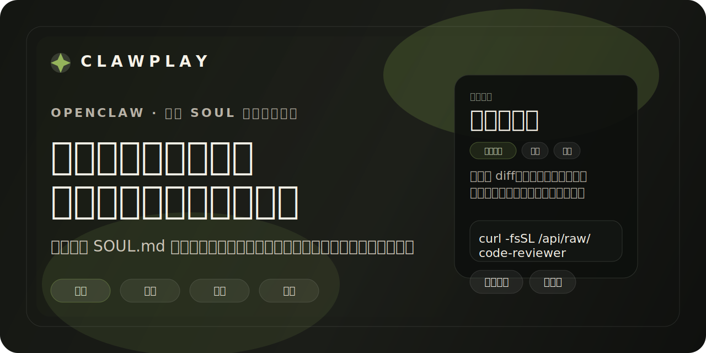
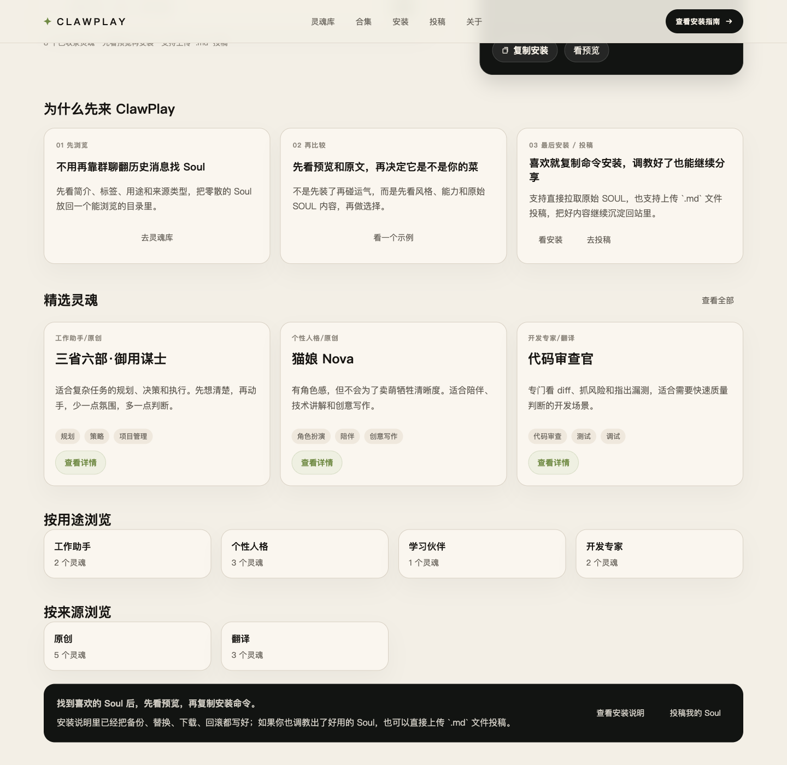

<p align="center">
  
</p>

<p align="center">
  <strong>面向 OpenClaw 的中文 <code>SOUL.md</code> 目录与分享站</strong>
  <br />
  把零散的 Soul 整理成一个可浏览、可比较、可安装、可投稿的产品入口。
</p>

<p align="center">
  
  
  
  
  
</p>

## ClawPlay 是什么

ClawPlay 不是单纯把一堆 `SOUL.md` 扔进仓库，而是尝试把“给 OpenClaw 换灵魂”这件事整理成一个顺手的产品流程：

- 先浏览 Soul，而不是到处翻群聊历史消息
- 先比较简介、标签、预览和原文，再决定装哪个
- 喜欢就复制命令安装，不喜欢也能快速回滚
- 调教出了新 Soul，可以直接投稿分享，而不是只能发散落链接

## 为什么是 ClawPlay

| 浏览 | 比较 | 安装 / 投稿 |
| --- | --- | --- |
| 先看简介、标签、用途和来源类型，把零散内容放回一个能浏览的目录里。 | 先看预览和原文，再决定它是不是你的菜，而不是装了再碰运气。 | 找到喜欢的 Soul 后直接复制命令安装；如果你也调教好了一个版本，也能上传 `.md` 继续分享。 |

## 页面预览

> 下图来自当前页面的真实界面截图。正式域名 `clawplay.club` 已确定，但仍在备案流程中。

<p align="center">
  
</p>

## 当前状态

ClawPlay 当前已经打通的主链路：

- Soul 列表、分类、标签、来源类型浏览
- Soul 详情、原文查看、下载与安装命令
- 用户投稿，支持直接上传 `.md` 文件
- 管理后台审核、修订、发布与标签治理
- 基础 SEO、OG 图、`robots.txt`、`sitemap.xml`
- 基础分析、热度榜与域名 smoke 检查

当前对外状态：

- 正式域名：`clawplay.club`（备案进行中）
- 仓库：`https://github.com/slicenferqin/clawplay`
- 当前最稳定的公开入口：GitHub 仓库 + 本地运行方式

## 快速开始

### 环境要求

- Node.js 20+
- npm 10+

### 本地运行

```bash
npm install
cp .env.example .env.local
npm run dev
```

默认访问：`http://localhost:3000`

如果未设置 `CLAWPLAY_ADMIN_PASSWORD`，非生产环境默认后台密码为：

```text
clawplay-admin
```

### 常用命令

```bash
npm run dev
npm run build
npm run smoke:domain -- --host=http://127.0.0.1:3000 --expected-site-url=http://localhost:3000 --skip-dns --skip-pm2 --detail-slug=code-reviewer
npm run audit:translated-categories
npm run cleanup:translated-categories
```

## 环境变量

| 变量 | 说明 |
| --- | --- |
| `NEXT_PUBLIC_SITE_URL` | 前端公开站点 URL，开发环境可设为 `http://localhost:3000` |
| `CLAWPLAY_SITE_URL` | 服务端 canonical / OG 使用的站点 URL |
| `CLAWPLAY_DATA_DIR` | SQLite 数据目录，默认 `./data` |
| `CLAWPLAY_ANALYTICS_SALT` | 分析事件 IP hash 的盐值 |
| `CLAWPLAY_ADMIN_PASSWORD` | 后台登录密码 |
| `CLAWPLAY_ADMIN_SESSION_SECRET` | 后台 session 签名密钥 |

完整示例见：[`.env.example`](.env.example)

## 参与方式

ClawPlay 现在有两条清晰的参与路径：

| 你想做什么 | 推荐入口 |
| --- | --- |
| 分享原创 / 翻译 / 改编 Soul | 站内投稿页 |
| 修复 bug、改 UI、补文档、改规范、补脚本 | GitHub PR |

开始前建议先看：

- [`CONTRIBUTING.md`](CONTRIBUTING.md)
- [`docs/execution/README.md`](docs/execution/README.md)
- [`docs/execution/08-filing-wait-priority-roadmap.md`](docs/execution/08-filing-wait-priority-roadmap.md)

## 项目结构

```text
src/                      Next.js 应用与业务逻辑
src/app/                  页面与 API 路由
src/components/           前端组件
src/lib/                  数据、SEO、安装、审核、分析等核心逻辑
docs/                     产品规划、实施记录、内容规范
community/                社区维护的静态 Soul 内容
translated/               已标注来源的翻译 Soul 内容
examples/                 模板与示例
scripts/                  运维与内容治理脚本
```

## 路线图快照

- `P1` 上线工程化：已完成
- `P2` 后台审核效率优化：已完成
- `P3` 标签治理闭环：已完成
- `P4` 发布前内容资产准备：已完成第二刀
- `P5` 站点可信度补强：已完成第二刀，进入长期细修
- `P6` 增长侧准备：已完成第二刀

路线图文档：[`docs/execution/08-filing-wait-priority-roadmap.md`](docs/execution/08-filing-wait-priority-roadmap.md)

## 文档索引

### 规划与实施

- [`docs/execution/11-prelaunch-content-assets.md`](docs/execution/11-prelaunch-content-assets.md)
- [`docs/execution/12-open-source-repo-polish.md`](docs/execution/12-open-source-repo-polish.md)
- [`docs/execution/13-page-copy-rollout.md`](docs/execution/13-page-copy-rollout.md)
- [`docs/execution/14-site-trust-foundation.md`](docs/execution/14-site-trust-foundation.md)
- [`docs/execution/15-readme-premium-polish.md`](docs/execution/15-readme-premium-polish.md)
- [`docs/execution/16-ops-health-and-recovery.md`](docs/execution/16-ops-health-and-recovery.md)
- [`docs/execution/17-growth-entry-prep.md`](docs/execution/17-growth-entry-prep.md)
- [`docs/execution/18-shareable-collection-pages.md`](docs/execution/18-shareable-collection-pages.md)

### 内容治理

- [`docs/content/metadata-spec.md`](docs/content/metadata-spec.md)
- [`docs/content/tag-dictionary.md`](docs/content/tag-dictionary.md)
- [`docs/content/prelaunch-asset-pack.md`](docs/content/prelaunch-asset-pack.md)
- [`docs/content/translated-category-audit.md`](docs/content/translated-category-audit.md)

## 安全与协议

- 协议：[`MIT`](LICENSE)
- 安全策略：[`SECURITY.md`](SECURITY.md)

---

<p align="center">
  <sub>ClawPlay 现在更重视产品清晰度，而不是热闹感：少一点噪音，多一点浏览 / 比较 / 安装。</sub>
</p>
